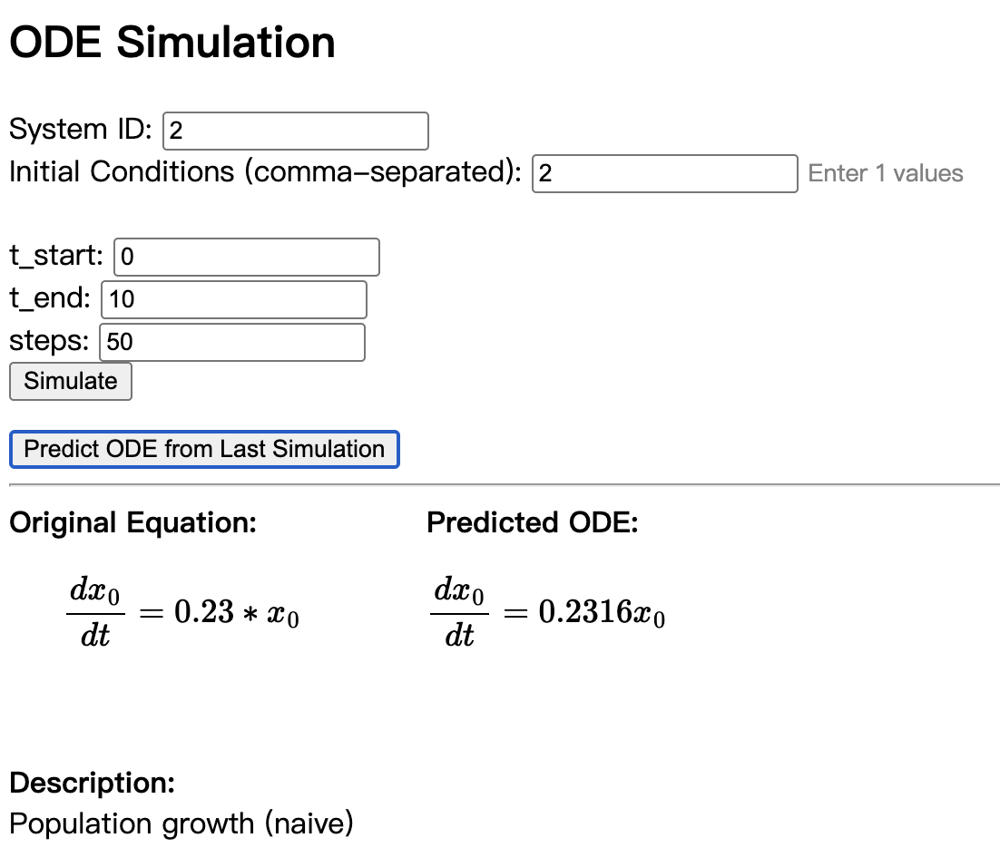

# DDOT

This repository contains the official implementation of the paper **"DDOT: A Derivative-directed Dual-decoder Ordinary Differential Equation Transformer for Dynamic System Modeling"**. The article has been recently published; a formal citation will be provided here soon.

A framework for symbolic regression and ODE discovery, featuring a web-based simulation and prediction interface.

<!-- Future citation:
@article{your_citation_key,
  title={DDOT: A Derivative-directed Dual-decoder Ordinary Differential Equation Transformer for Dynamic System Modeling},
  author={...},
  journal={...},
  year={202X}
}
-->

---

## Installation

### Using Conda

```bash
conda env create -f environment.yml
conda activate your_env_name
```

### Using Docker

```bash
docker build -t ddot-app .
docker run -p 8000:8000 ddot-app
```

---

## Data Generation

Generate the data for pretraining:

```bash
python generate_data.py
```

---

## Training

Edit the parameters in `run.py` as needed and run:

```bash
python run.py
```

---

## Evaluation

Evaluate DDOT & ODEFormer (set `"use_ft_decoder"` accordingly):

```bash
bash run_evaluation.sh
```

Evaluate other baselines:

```bash
bash run_baselines.sh
```

Gather the result table:

```bash
python gather_result.py
```

---

## Running the Web App

After installing dependencies or building the Docker image, start the FastAPI app:

```bash
uvicorn app.main:app --reload
```

The app will be available at [http://localhost:8000](http://localhost:8000).

---

## Example Input/Output

**Input:**  
- Select a system ID (e.g., `0`)
- Enter initial conditions (e.g., `1.0,1.0,1.0`)
- Set time range and steps
- Click "Simulate" to see the trajectory plot
- Click "Predict ODE from Last Simulation" to see the predicted ODE

**Output:**  
- Simulation plot (PNG)
- Original ODE (LaTeX)
- Predicted ODE (LaTeX, side-by-side with original)

---

## Web UI Preview

<!-- Replace the link below with your actual screenshot or GIF -->


---

## Notes

- Long simulation sequences or complex ODE systems may cause increased computation time during simulation or prediction.
- For best performance, use moderate time ranges and step counts when exploring new systems.

---

## License

See [LICENSE](LICENSE) for details.

